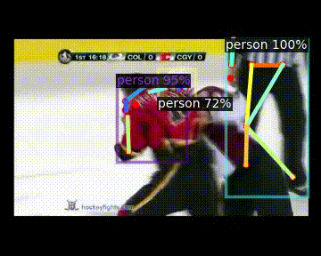
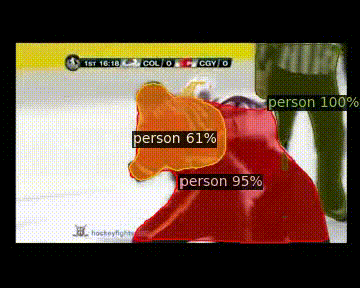
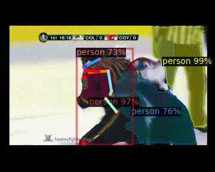

# pose_detection
##### To visualize the functioning of the main script in order to run detectron2 on videos and save results in ./ouput/joint/detectron/
> python main.py -help

##### Get single/multiple info stored in .pkl file:
###### 'pred_boxes', 'scores', 'pred_classes', 'pred_keypoints', 'pred_keypoint_heatmaps' 

> from read_keypoints import ReadKeypoints \
> rk = ReadKeypoints(path_to_pkl_file) \
> dict_frame_info = rk.get_features(['arg_1', 'arg_2', ...])

